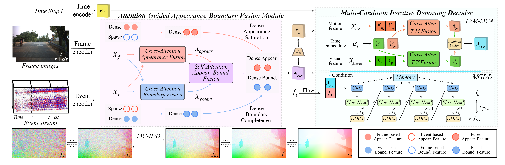

# Injecting Frame-Event Complementary Fusion into Diffusion for Optical Flow in Challenging Scenes

## NeurIPS2025 Spotlight

[Haonan Wang](https://scholar.google.com.hk/citations?hl=zh-CN&view_op=list_works&gmla=AH8HC4wel7f5UzHZm3NN_RHl9by4ODKcg12HuynxhWBbyyFpY3GCQp_wRryBPNSci76ZfoOB8_IDasu-vEEyzy9skm3tDy0&user=LCNXgmAAAAAJ) $^{1}$, [Hanyu Zhou](https://hyzhouboy.github.io/) $^{2✉}$,  [Haoyue Liu](https://scholar.google.com.hk/citations?hl=zh-CN&user=DadbHdAAAAAJ) $^1$, [Luxin Yan](https://scholar.google.com.hk/citations?user=5CS6T8AAAAAJ&hl=zh-CN) $^{1}$

$^1$ Huazhong University of Science and Technology  $^2$ National University of Singapore

$^✉$ Corresponding Author.

## News

2025.09.18: Our paper is accepted by NIPS 2025 as Spotlight paper. The code is coming soon.

